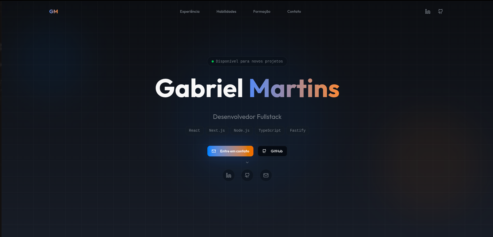

# 🚀 Portfólio Pessoal - Gabriel Martins

Portfólio profissional desenvolvido para apresentar minhas habilidades, experiências, projetos e formação como Desenvolvedor.



### Objetivo

O objetivo deste projeto é:
- Apresentar minhas habilidades e experiências
- Facilitar o contato com potenciais clientes e empregadores
- Servir como vitrine dos meus projetos e conquistas profissionais

## 🛠️ Tecnologias Utilizadas

### Frontend
- **[Next.js 16](https://nextjs.org/)** - Framework React para produção com App Router
- **[React 19](https://react.dev/)** - Biblioteca JavaScript para construção de interfaces
- **[TypeScript](https://www.typescriptlang.org/)** - Superset JavaScript com tipagem estática
- **[Tailwind CSS 4](https://tailwindcss.com/)** - Framework CSS utility-first
- **[Radix UI](https://www.radix-ui.com/)** - Componentes acessíveis e não estilizados
- **[Lucide React](https://lucide.dev/)** - Biblioteca de ícones

### Backend & Banco de Dados
- **[Drizzle ORM](https://orm.drizzle.team/)** - ORM TypeScript moderno e leve
- **[Neon Serverless](https://neon.tech/)** - Banco de dados PostgreSQL serverless
- **[Zod](https://zod.dev/)** - Validação de schemas TypeScript-first

### Ferramentas de Desenvolvimento
- **[Biome](https://biomejs.dev/)** - Linter e formatador rápido
- **[Drizzle Kit](https://orm.drizzle.team/kit-docs/overview)** - Ferramentas CLI para Drizzle ORM
- **[TSX](https://github.com/esbuild-kit/tsx)** - Executor TypeScript para Node.js

## 📁 Estrutura do Projeto

```
my-portfolio/
├── src/
│   ├── app/                    # App Router do Next.js
│   │   ├── _components/        # Componentes da página principal
│   │   │   ├── contact/        # Formulário de contato
│   │   │   ├── education/      # Seção de formação e certificações
│   │   │   ├── experience/     # Seção de experiências profissionais
│   │   │   ├── footer/         # Rodapé
│   │   │   ├── hero/           # Seção hero (inicial)
│   │   │   ├── navbar/         # Barra de navegação
│   │   │   └── skills/         # Seção de habilidades
│   │   ├── globals.css         # Estilos globais
│   │   ├── layout.tsx          # Layout principal
│   │   └── page.tsx            # Página inicial
│   ├── components/
│   │   └── ui/                 # Componentes UI reutilizáveis
│   ├── db/
│   │   ├── index.ts            # Configuração do banco de dados
│   │   └── schema.ts           # Schemas do Drizzle ORM
│   ├── lib/
│   │   └── utils.ts            # Utilitários
│   └── util/
│       └── env.ts              # Validação de variáveis de ambiente
├── drizzle/                    # Migrações do banco de dados
├── public/                     # Arquivos estáticos
└── scripts/                    # Scripts utilitários
```

## 🚀 Como Executar

### Pré-requisitos

- Node.js 18+ instalado
- npm, yarn, pnpm ou bun
- Banco de dados PostgreSQL (recomendado: Neon Serverless)

### Instalação

1. Clone o repositório:
```bash
git clone https://github.com/seu-usuario/my-portfolio.git
cd my-portfolio
```

2. Instale as dependências:
```bash
npm install
# ou
yarn install
# ou
pnpm install
```

3. Configure as variáveis de ambiente:
```bash
cp .env.example .env
```

Edite o arquivo `.env` com suas credenciais:
```env
DATABASE_URL=sua_url_do_banco_de_dados
```

4. Execute as migrações do banco de dados:
```bash
npm run db:push
# ou
npm run db:migrate
```

5. (Opcional) Popule o banco com dados iniciais:
```bash
npm run db:seed
```

### Executando o Projeto

```bash
# Modo desenvolvimento
npm run dev

# Build para produção
npm run build

# Iniciar servidor de produção
npm start
```

Acesse [http://localhost:3000](http://localhost:3000) no seu navegador.

## 📜 Scripts Disponíveis

- `npm run dev` - Inicia o servidor de desenvolvimento
- `npm run build` - Cria build de produção
- `npm run start` - Inicia servidor de produção
- `npm run lint` - Executa o linter (Biome)
- `npm run format` - Formata o código automaticamente
- `npm run db:generate` - Gera migrações do banco de dados
- `npm run db:migrate` - Executa migrações do banco de dados
- `npm run db:push` - Sincroniza schema com o banco de dados
- `npm run db:studio` - Abre Drizzle Studio (interface visual do banco)

## 📝 Seções do Portfólio

- **Hero**: Apresentação inicial com nome, título e tecnologias principais
- **Experiência**: Histórico profissional com projetos e tecnologias utilizadas
- **Habilidades**: Categorias de habilidades técnicas organizadas por área
- **Formação**: Histórico acadêmico e certificações profissionais
- **Contato**: Formulário para recebimento de mensagens

## 📄 Licença

Este projeto é privado e de uso pessoal.

## 👤 Autor

**Gabriel Martins**

- Email: martinsgabrieldev@gmail.com
- LinkedIn: [martins-gab](https://linkedin.com/in/martins-gab)
- GitHub: [martinsgabriel1956](https://github.com/martinsgabriel1956)

